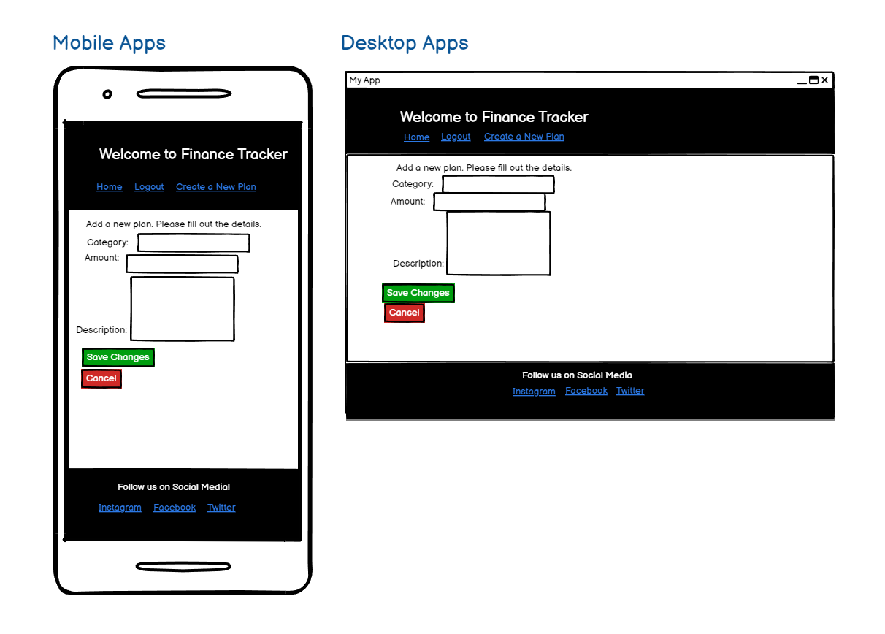

# Django Finance Tracker

This is my milestone 4 project of the Code Institute Full Stack Web Development Course.
The goal of the project is to build a Full-Stack Web application using an MVC (Model-Template-View) framework.
Finance Tracker is a web aplicaton for managing your financial expenses which utilises Django as a framework.

This tracker should provide everyone with a simple tool to plan their monthly budget or maybe even their next vacation.

Deployed Website Link: https://financial-plannero-4a862bf56c00.herokuapp.com/
GitHub Repo: https://github.com/KarolSU96/finance-tracker

## UX 

The finance tracker has a simple and easy-to-use design. The color aesthetic and font work well together and have a modern aesthetic.
The pages are responsive and appopriate for all devices. The functionality stays the same on both mobile and desktop.

### Design
Thanks to Bootstrap the pages stay responsive and look good on all devices.

### Typography
The font used throughout the application is Lato, which means summer in Polish.
It's a sans serif typeface, designed in the Summer 2010 by Lukas Dziedzic.
It has a fresh, aesthetic and is highly readable.

-[Lato](https://fonts.google.com/specimen/Lato?preview.text=Finance%20Tracker)

### User Stories

"As a user, I would like to**: ________"

- be able to sign up so that I can have a personalized account on the website.
- create a plan by adding details such as budget amount, plan name, description so that I can efficiently manage nad plan my budget.
- see a plans overview, including total budget, total spent, remaining balance, so I can make informed decisions about my finances at glance.
- open a specific plan, revealing a list of transactions so that I can gain insights into my spending patterns.
- add a transaction easily, specifying the amount, category, description so that I can keep an accurate record of my spending.
- add a new plan for a different month or purpose so that I can effectively track my budget across various time spans.
- delete transactions so that I mantain accurate financial records by removing inaccuracies.
- edit transactions so that I can reflect the changes in my spending patterns or bills.
- delete plans so that I keep the dashboard organized removing unused or outdated plans.
- be notified about changes that I make to the transactions and plans so that I have better awareness of the changes and enhanced user experience.

### Site Admin

"As a site administrator, I can :________"
- Access and analyze overall application data to monitor user activity, identify trends and ensure the platform's optimal performance.
- Manage the categories by adding and deleting them to mantain a relevant and organized classification system for user transactions.

## Wireframes
- Index:

- Add Plan:

- Plan Details

- Edit Transaction

## Features
1. User Authentication: 
- Secure sign-up, log-in and log out functionalities.
- Ensures user data privacy and protection.

2. Plan Management:
- Create and delete financial plans effortlessly.
- Quick overview of existing plans.

3. Transaction Management:
- Add new transactions to plans, specifying the amount, category and description.
- Edit and delete transactions to maintain accurate financial records.

4. Category Management:
- Categorize transactions to track spending patterns.

5. User-Friendly Interface:
- Intuitive and responsive design for seamless navigation.

6. Alerts and Notifications:
- Notifies user for successful actions (e.g., login, plan creation, transaction addition)

7. User-Friendly Forms:
- Easy-to-use forms for adding and editing transactions.

 
## Future Features
- Edit Plan  functionality
- Data Visualisation: Diagrams for displaying the patterns in spending.
- Enhanced site styling

## Bugs and Errors

How great would it be to not be restricted by time? Unfortunately for us, 3 dimensional beings, the time flows and I didn't have enough of it to fix all the bugs. So here they are:
- SweetAlerts notifications sometimes are taking a bit too much space on mobile. I tried numerous ways to style it differently but nothing has worked yet. In the docs, it says that the width should be editable when we fire the swal as one of the properties of the object. Will definitely fix this in the future when I have time.
- Plan table is a bit too big on some mobile devices and sometime doesn't sacale. It still displays the information nicely but sometimes the user needs to scroll a bit to the right, to see the plan description for example.

But there is the good news. The bugs that I encountered and fixed are:
- Footer covering the buttons and website being unresponsive.  Fix: Added the margin bottom bootstrap class for the main sections in the templates.
- Static files not loading on deployed website. Fix: In settings.py the Installed apps the cloudinary need to be listed in specific order:
  'cloudinary_storage',
  'django.contrib.staticfiles',
  'cloudinary'
- Edit Transaction Page NonReverseMatch error. Fix: passing the whole transaction object to the context instead of its attributes, accessing the attributes with dot notation in the template.
- Changes to the template are not visible after adding allauth. Fix: Expanding the DIRS part of the TEMPLATES configuration in the settings.py. 

## Technologies Used
- HTML 5 for structuring the markup text
- CSS3 used for styling, althought most of the styling was done with Bootstrap
- JavaScript - used for displaying the notifications
- Django: Web framework for Python
- Bootstrap: Front-end framework
- SweetAlert: Customizable alerts for better user experience
- Git Hub used for secure online code storage
- Codeanywhere used as a cloud-based IDE for development
- Heroku for Deployment
- Cloudinary for handling static files static files
  

## Testing

I planned and performed various tests to fix bugs and validated the HTML, CSS, JavaScript, Python code. Results can be seen below.

### HTML

I used the recommended [HTML W3C Validator](https://validator.w3.org) to validate my HTML files.

| Page | Screenshot | Passed / Notes |
| --- | --- | --- |
Homepage - index.html - |  | No warnings.|
Add Plan - add_plan.html |  | There is a bug that shows that there is a h1 element in line 40- couldn't find anything like this in my code. |
Plan details - plan_details.html |  | 1 warning, possibly a bug, because I am aria-labeling the modal that has an attribute of aria-hidden. |
Edit Transaction Page - edit_transaction.html | | There is a bug that shows that there is a h1 element in line 40- couldn't find anything like this in my code. |

### CSS

I used the recommended [Jigsaw Validator](https://jigsaw.w3.org/css-validator) to validate my CSS file.

No errors. 216 warnings that target bootstrap classes.

### JavaScricpt

I used the recommended [JShint Vadalidator](https://jshint.com) to validate my JS file.

Two warnings about ES6, which can be ignored.
Swal is a SweetAlert variable.

### Python

I used the recommended [PEP8 Python Validator](https://pep8ci.herokuapp.com) to validate my Python Files.

All of the Python files have been tested in PEP8 CI Python Linter. No Errors found except for the settings.py where there is a problem with a too long line which I couldn't fix because If I split the line then the Validator says that the scond line is either over or under indented.

### Lighthouse Testing
| Page | Screenshot | Desktop / Mobile |
| --- | --- | --- |
| Home Page |  | Desktop |
| Home Page |  | Mobile |
| Add Plan Page |  | Desktop |
| Add Plan Page |  | Mobile |
| Plan Details Page |  | Desktop |
| Plan Details Page |  | Mobile |
| Edit Transaction Page |  | Desktop |
| Edit Transaction Page |  | Mobile |

### Manual Tests
To ensure the functionality, usability, responsiveness and data management within the web application, I carried out various manual tests which will are described below.

* **Functionality Tests**

    * **User Authentication**

        * Test Case 1: User Registration:
            1. Navigate to registration page.
            2. Fill in the required fields (I disabled email verification as it's just a school project)
            3. Submit the registration form.
            - **Expected Result**: The user is successfully registered and can log in.
    
        * Test Case 2: User Login and Logout:
            1. Navigate to the login page.
            2. Enter valid credentials.
            3. Submit the login form.
            4. Log out.
            - **Expected Result**: The user can log in and log out successfully.

* **Usability Tests**

    * **User Interface**

        * Test Case 1: Navigation:
            1. Navigate to different pages.
            2. Click on various buttons.
            - **Expected Result**: All navigation elements work as expected.

        * Test Case 2 : Notifications:
            1. Log in, out, add transactions and change data.
            - ** Expected Result**: The user should be notified about changes to the data.
    * **Responsiveness Tests**
    
        * Test Case: Mobile Responsiveness:
            1. Open the application on various mobile devices.
            2. Test different functionalities on mobile.
            - **Expected Result**: Respondive deisgn on different devices.
    
    
    * ** Data Management Tests**:

        * Test Case: Budget Calculations:
            1. Create a plan with a specific budget.
            2. Add transactions and check budget calculations.
            - **Expected Result**: Accurate budget calculations based on transactions. If the transaction exceeds the budget, the user is notified with a pop-up alert. 

## Deployment
  1. Clone the Repository
  2. Navigate to Project Directory
  3. Intall Dependencies
  4. Configure Enviroment Variables
  5. Apply Database Migrations
  6. Run Development Server
  7. Access the Application

## Credits
- This web app uses Code Institute Full Template.
- SweetAlert for beautiful alerts.
- Bootstrap team for making my life easier when it comes to styling of my page.
